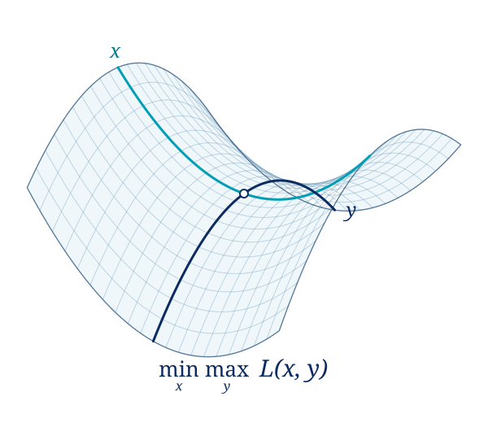

<section class="home-hero home-width" markdown>
<div class="hero-copy" markdown>

# <span class="hero-title-line">A Scalable Solver <span class="hero-title-for">for</span></span> <em class="hero-title-line">Convex Conic Quadratic Programming</em>

<p class="hero-description">Open-source, GPU-accelerated optimization.</p>

<div class="hero-actions" markdown>

[Get started](installation.md){ .home-button .home-button-primary }
[Documentation →](documentation/index.md){ .home-button .home-button-secondary }

</div>

<div class="hero-install" markdown>

```bash
pip install pdhcg
```

</div>
</div>

<figure class="hero-geometry">
  
</figure>
</section>

<section class="home-formulation home-width" aria-labelledby="problem-formulation" markdown>

## Problem formulation

<div class="formulation-stage" markdown>
<div class="formulation-compact" id="compact-formulation" markdown>

$$
\begin{aligned}
\min_x\quad &\tfrac12x^\top Hx+c^\top x\\[8pt]
\text{s.t.}\quad &\mathcal A x\in\mathcal C.
\end{aligned}
$$

</div>
<div class="formulation-full" id="full-formulation" hidden markdown>

$$
\begin{aligned}
\min_x\; &\tfrac12x^\top(Q+R^\top D R)x+c^\top x\\[6pt]
\text{s.t.}\; &\ell_c\le Ax\le u_c,\\[3pt]
&Fx+g\in\mathcal K_a,\\[3pt]
&\ell_v\le x\le u_v,\\[3pt]
&x_J\in\mathcal K_v.
\end{aligned}
$$

</div>
</div>
<div class="formulation-controls">
<button class="formulation-toggle" type="button" aria-expanded="false" aria-controls="full-formulation" data-formulation-toggle>
  <span data-formulation-label>Show full formulation</span>
  <svg viewBox="0 0 20 20" width="18" height="18" fill="none" aria-hidden="true"><path d="M4 10h12M10 4v12" stroke="currentColor" stroke-width="1.5" stroke-linecap="round"/></svg>
</button>
</div>
</section>

<section class="home-width feature-grid" id="key-features" aria-label="Solver capabilities" markdown>
<article class="feature" markdown>

### [Quadratic objectives](python/model.md)

Sparse and low-rank structure, preserved from model to solution.

</article>
<article class="feature" markdown>

### [Conic constraints](examples.md#conic-examples)

Second-order, semidefinite, exponential, and power cones.

</article>
<article class="feature" markdown>

### [Multi-GPU solving](installation.md#build-with-multi-gpu-support)

Scale the native solver with MPI and NCCL.

</article>
</section>

<section class="home-width home-section start-grid" id="get-started" markdown>
<div class="start-copy" markdown>

## Start Now

Use Python, CVXPY, or the command line. Requires NVIDIA CUDA 12.4+.

[Installation & quick start →](installation.md){ .text-link }

</div>
<div class="home-code" markdown>

=== "Python"

    ```python
    import numpy as np
    from scipy import sparse
    from pdhcg import Model

    # min ½ xᵀQx + cᵀx, subject to x ≥ 0
    model = Model(
        objective_matrix=sparse.eye(2, format="csc"),
        objective_vector=np.array([-1.0, -2.0]),
        variable_lower_bound=np.zeros(2),
    )
    model.optimize()

    print(model.Status, model.X)
    ```

=== "CVXPY"

    Install with `pip install "pdhcg[cvxpy]"`.

    ```python
    import cvxpy as cp
    import pdhcg.cvxpy_backend

    x = cp.Variable(2)
    problem = cp.Problem(
        cp.Minimize(
            0.5 * cp.sum_squares(x) - x[0] - 2 * x[1]
        ),
        [x >= 0],
    )
    problem.solve(solver="PDHCG", eps=1e-6)

    print(problem.status, x.value)
    ```

=== "Command line"

    ```bash
    # Build the native solver
    git clone https://github.com/Lhongpei/PDHCG.git
    cd PDHCG
    cmake -S . -B build
    cmake --build build --clean-first

    # Solve your problem file
    ./build/pdhcg problem.qps ./output

    # Accepts MPS, QPS, CBF, and gzip variants
    ./build/pdhcg problem.cbf.gz ./output
    ```

</div>
</section>

<section class="algorithm-section" id="algorithm" markdown>
<div class="home-width" markdown>
<div class="algorithm-heading" markdown>

## Algorithm

[Explore the algorithm →](algorithm.md){ .text-link }

</div>

PDHCG keeps quadratic objectives and conic constraints in a primal–dual formulation. Each update combines a quadratic proximal solve with cone projections.

</div>
</section>
